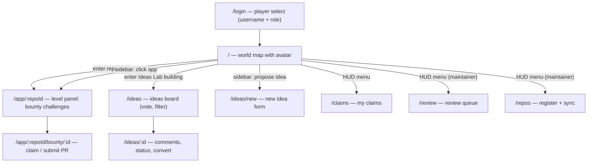

# Frontend Plan: Campus Bug Bounty Board — World Map Edition

The frontend is a Mario-style overworld (reference: New Super Mario Bros. Wii world map). Instead of a conventional dashboard, students land on a map and walk an avatar between level nodes with the arrow keys. The game metaphor maps 1:1 onto the existing backend — no backend or API contract changes needed.

## How the game concept maps to the backend

- **Level node = registered Repo (campus app).** Nodes are placed on the map from `GET /api/repos`. Each node shows the app name and a badge with its open-bounty count.
- **Entering a level = the app's bounty list.** Press Enter/Space (or click) on a node to open a game-styled level panel listing that app's bounties as "challenges": difficulty shown as 1–3 stars, status as game icons (open = unbeaten dot, claimed = flag, in_review = hourglass, completed = star).
- **Beating a challenge = the normal bounty lifecycle.** Claim, submit PR URL, review, complete — same flows and endpoints as before, presented inside the level panel.
- **Ideas Lab = a special building on the map** (like the Toad House). Walking into it opens the Ideas board: propose features or new apps, vote, comment. A maintainer converting an idea to a bounty makes it show up inside that app's level.
- **New apps grow the world.** Registering a repo adds a new node to the map path. Stretch: `new-app` ideas marked `planned` appear as greyed-out "under construction" nodes.
- **HUD = everything else.** Mario-style corner HUD: current user badge (top-left, like the life counter), "Menu" (top-right) opening My Claims, and for maintainers, Review Queue and Register Repo. These open as game-styled overlays, not separate conventional pages.
- **Quick-access sidebar bypasses the map.** For students who don't want to walk the avatar around: a collapsible sidebar (HUD toggle button, `Tab` shortcut) lists all current apps with open-bounty counts and a search box; clicking one jumps straight to its level panel (`/app/:repoId`). It also has a prominent "Propose an idea" button opening the new-idea form directly (`/ideas/new`, pre-set to `new-app`). Same routes the map uses — the sidebar is just a second door, so nothing is duplicated.

## Practicality decisions

- **DOM + CSS, no game engine.** The map is a full-screen React component: a Tailwind/CSS scenery background (sky, hills, decorations), an SVG dotted trail through ~12 predefined path slots (percentage coordinates), and absolutely-positioned node components filling slots in repo order. The avatar is a sprite div animated between slot coordinates with framer-motion. This keeps everything inspectable, accessible, and fast to build — no canvas or Phaser risk.
- **Keyboard is the delight, mouse always works.** Arrow keys move the avatar node-to-node; Enter/Space enters. Every node and HUD element is also clickable, so the demo can't be derailed and it stays usable.
- **Overlays are routed.** The map stays mounted at `/`; panels are route-driven overlays so views are deep-linkable: `/app/:repoId`, `/app/:repoId/bounty/:bountyId`, `/ideas`, `/ideas/new`, `/ideas/:id`, `/claims`, `/review`, `/repos`, plus `/login` as a "player select" screen.
- **Game styling via fonts and components, not assets.** Pixel font (Press Start 2P) for HUD numbers/titles, readable font for body text, chunky bordered shadcn/ui dialogs skinned to look like game panels. Simple emoji/CSS sprites for the avatar and node icons to start; drawn assets are a polish step.

## Stack

- Vite + React + TypeScript in `frontend/`
- Tailwind CSS + shadcn/ui (dialogs, forms, toasts) with a game-panel skin
- React Router (map + overlay routes), TanStack Query for server state
- framer-motion for avatar movement and panel transitions
- Typed API client targeting FastAPI at `localhost:8000` via Vite dev proxy on `/api`

## API contract (agreement with backend teammate — unchanged)

Contract from [plan.md](plan.md) lives in `frontend/src/api/types.ts` and `frontend/src/api/client.ts`; any mismatch is isolated there.

- `POST /api/auth/login` (dev login: `{ username, role }`) — returns user; sent as `X-Username` header
- `GET /api/bounties` (filters: repo, difficulty, status), `GET /api/bounties/:id`, `POST /api/bounties` (maintainer)
- `POST /api/bounties/:id/claim`, `POST /api/bounties/:id/release`
- `POST /api/claims/:id/submission` (PR URL), `GET /api/me/claims`
- `GET /api/submissions?status=pending`, `POST /api/submissions/:id/review` (approve / request_changes / reject)
- `GET/POST /api/repos`, `POST /api/repos/:id/sync`
- `GET/POST /api/ideas`, `GET /api/ideas/:id`, `PUT/DELETE /api/ideas/:id/vote`, `GET/POST /api/ideas/:id/comments`, `PATCH /api/ideas/:id/status`, `POST /api/ideas/:id/convert`

## Screen map

## Cross-cutting pieces

- Auth context in `localStorage`, `X-Username` injected by the client, redirect to `/login` when logged out
- Reusable game-styled status components: star difficulty, bounty status icons, CI badge (passing / failing / none)
- Toasts styled as game notifications ("Bounty claimed!") via sonner; TanStack Query for loading/error states

## Build order

1. Scaffold + API contract (unblocks everything)
2. Login + HUD shell
3. World map with static slots and repo nodes, then arrow-key avatar navigation
4. Level panel → bounty detail with claim/submit (the core demo flow)
5. Quick-access sidebar (app list + propose-idea shortcut)
6. My claims, review queue, repos overlays
7. Ideas Lab
8. Polish pass (under-construction nodes, sounds, flags)
