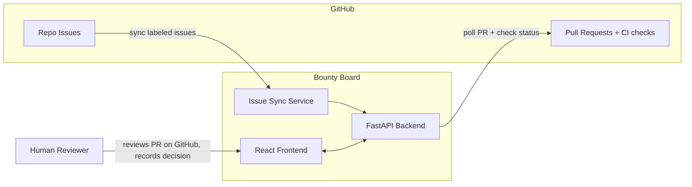

# Campus Bug Bounty Board

## Architecture

- `frontend/` — React + Vite + TypeScript, talks to the API
- `backend/` — FastAPI (Python) + SQLite via SQLAlchemy (easy to swap to Postgres later)
- GitHub REST API integration via a server-side token for issue sync and PR status checks

## Data model

- **User** — GitHub username, role (`student` / `maintainer`). Auth: GitHub OAuth if time permits; otherwise a simple "log in as GitHub username" dev login for the hackathon (decision deferred to implementation, OAuth is a stretch goal).
- **Repo** — registered campus app repo (`owner/name`), maintainer, description, sync settings.
- **Bounty** — title, description, difficulty tag, status (`open` → `claimed` → `in_review` → `completed`), source (`synced` with `github_issue_number`/URL, or `manual`).
- **Claim** — bounty + user + timestamp; one active claimer per bounty, cap of ~2 active claims per user, releasable/expirable so bounties don't get squatted.
- **Submission** — claim + PR URL, cached PR state (open/merged/closed) and CI check status from GitHub, review decision.
- **Idea** — title, description, category (`feature` for an existing app, or `new-app`), optional linked Repo (for feature ideas), author, status (`open` / `planned` / `done`).
- **IdeaVote** — idea + user + value (+1 / -1), unique per (idea, user) so each person gets one vote they can change or remove.
- **IdeaComment** — idea + user + body + timestamp (flat list, no threading for the hackathon).

## Bounty lifecycle

1. **Register repo** — maintainer adds `owner/name`; backend validates it exists via GitHub API.
2. **Create bounties** — two paths, as requested:
   - *Sync*: backend pulls open issues labeled `bounty` (label is the curation mechanism — maintainers tag issues on GitHub) on demand ("Sync now" button) and on a periodic background task.
   - *Manual*: maintainers post bounties directly through a form.
3. **Claim** — student claims a bounty; it locks for them.
4. **Submit** — student opens a PR on GitHub (fork workflow), then pastes the PR URL. Backend verifies via GitHub API that the PR exists, targets the right repo, and (when possible) that the author matches the claimer's GitHub username.

## Ideas board

A second board, separate from bounties, where anyone can propose features for existing campus apps or entirely new apps.

- **Post** — any logged-in user creates an idea with title, description, category (`feature` / `new-app`), and optionally tags a registered repo.
- **Vote** — upvote/downvote with a net score; one vote per user per idea, toggleable. Board sorts by score (default) or newest.
- **Comment** — flat comment thread on each idea's detail page.
- **Promote** — a maintainer can mark an idea `planned` and later `done`; a feature idea on their repo can be converted into a bounty on the bounty board (prefills title/description), connecting the two boards.
- Endpoints: ideas (list/create), votes (cast/change/remove), comments (list/create), status change (maintainer only).

## Testing and PR review (human-in-the-loop)

- **Automated gate first**: the backend fetches the PR's combined CI status / check runs from GitHub. Submissions display a CI badge, and reviewers see a warning if checks are failing or the repo has no CI. Repos are encouraged to have GitHub Actions tests; the platform doesn't run code itself — this keeps us out of the sandboxing business.
- **Human review**: actual code review happens on GitHub (comments, requested changes). The platform provides a **review queue** for maintainers showing pending submissions with PR link + CI status. Reviewer records a decision: approve, request changes (bounty goes back to `claimed`), or reject (claim released).
- **Completion**: on approve + merged PR (backend confirms merge state via API), the bounty flips to `completed` and shows on the student's profile.
- The review decision is modeled as its own step (not inferred purely from GitHub state), so an AI reviewer can be slotted in later without schema changes.

## Frontend pages

- **Board** — filterable bounty grid (repo, difficulty, status)
- **Bounty detail** — description, linked GitHub issue, claim/release/submit actions
- **My claims** — active claims and submission status
- **Review queue** — maintainer view with CI badges and approve/request-changes/reject actions
- **Repos** — register + sync repos
- **Ideas board** — sortable list (top / newest) with vote buttons and category filter
- **Idea detail** — full description, voting, comments, maintainer status controls and convert-to-bounty

## Out of scope (per your answers)

No rewards/points/leaderboard, no payments, no automated code execution or AI review (human review only for now).
